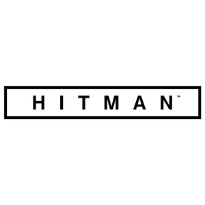

<p align="center">
  <a href="http://nestjs.com/" target="blank"></a>
</p>
  <p align="center">An app RESTful Api</p>
    <p align="center">
<a target="_blank"></a>
<a target="_blank"></a>
<a target="_blank"></a>
<a target="_blank"></a>
<a target="_blank"></a>
<a target="_blank"></a>
<a target="_blank"></a>
<a target="_blank"></a>
</p>

## Description
Julien and Corentin.
Welcome to our discreet platform, fellow assassins! 😎

As your host, I'm here to explain to you how your mission will unfold.

Browse through our exclusive contracts, each one tailored to challenge your skills to the max. Remember, you can only juggle up to 5 contracts at once – keeping you sharp and agile.


Should you need assistance, our team is at your service, shrouded in secrecy. 🕵️‍♂️

Become the ultimate shadow professional. Stay covert, stay ready, and emerge victorious. Happy hunting, assassin! 🎯🔪

## Installation

```bash
$ npm install
```

## Running the app

```bash
# development
$ npm run start

# watch mode
$ npm run start:dev

# production mode
$ npm run start:prod
```

## Contact

- Author - Eric Ling
- Email - ericlingfr@gmail.com

